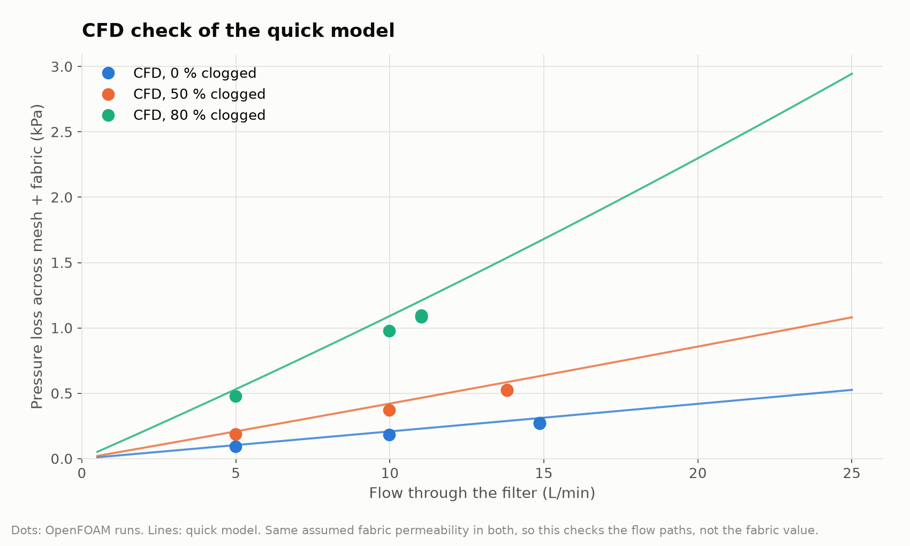

# CFD results

Each row is one OpenFOAM run. Sensor values are what the LCD would show; flows are what leaves through the outlet (filtered) and the overflow (unfiltered). Pictures and summary.json for each run are in the folder of the same name; videos are in the `videos` artifact of the Actions run.

| Inflow (L/min) | Clogging | P1 (kPa) | P2 (kPa) | dP (kPa) | Filtered (L/min) | Overflow (L/min) | Fabric loss (Pa) | Converged* | Folder |
| --- | --- | --- | --- | --- | --- | --- | --- | --- | --- |
| 5 | 0 % | 0.00 | 0.09 | 0.10 | 5.0 | 0.0 | 92 | no | [q05p0_c00](q05p0_c00/) |
| 5 | 50 % | 0.00 | 0.09 | 0.19 | 5.0 | 0.0 | 185 | no | [q05p0_c50](q05p0_c50/) |
| 5 | 80 % | 0.00 | 0.09 | 0.48 | 5.0 | 0.0 | 464 | no | [q05p0_c80](q05p0_c80/) |
| 10 | 0 % | 0.00 | 0.80 | 0.21 | 10.0 | 0.0 | 183 | no | [q10p0_c00](q10p0_c00/) |
| 10 | 50 % | 0.00 | 0.80 | 0.40 | 10.0 | 0.0 | 369 | no | [q10p0_c50](q10p0_c50/) |
| 10 | 80 % | 0.34 | 0.80 | 1.02 | 10.0 | 0.0 | 927 | no | [q10p0_c80](q10p0_c80/) |
| 15 | 0 % | 0.77 | 1.94 | 0.32 | 14.9 | 0.1 | 270 | no | [q15p0_c00](q15p0_c00/) |
| 15 | 50 % | 0.73 | 1.65 | 0.56 | 13.8 | 1.2 | 508 | no | [q15p0_c50](q15p0_c50/) |
| 15 | 80 % | 0.64 | 1.00 | 1.12 | 11.0 | 4.0 | 1023 | no | [q15p0_c80](q15p0_c80/) |
| 20 | 0 % | 0.79 | 1.93 | 0.34 | 14.9 | 5.1 | 270 | no | [q20p0_c00](q20p0_c00/) |
| 20 | 50 % | 0.74 | 1.65 | 0.57 | 13.8 | 6.2 | 509 | no | [q20p0_c50](q20p0_c50/) |
| 20 | 80 % | 0.62 | 1.00 | 1.09 | 11.0 | 9.0 | 1023 | no | [q20p0_c80](q20p0_c80/) |
| 25 | 0 % | 0.77 | 1.93 | 0.31 | 14.9 | 10.1 | 270 | no | [q25p0_c00](q25p0_c00/) |
| 25 | 50 % | 0.74 | 1.65 | 0.57 | 13.8 | 11.2 | 508 | no | [q25p0_c50](q25p0_c50/) |
| 25 | 80 % | 0.69 | 1.00 | 1.17 | 11.0 | 14.0 | 1023 | no | [q25p0_c80](q25p0_c80/) |

*Converged: the solver met its residual targets, or else how much P1/P2 still changed over the last quarter of the iterations.

